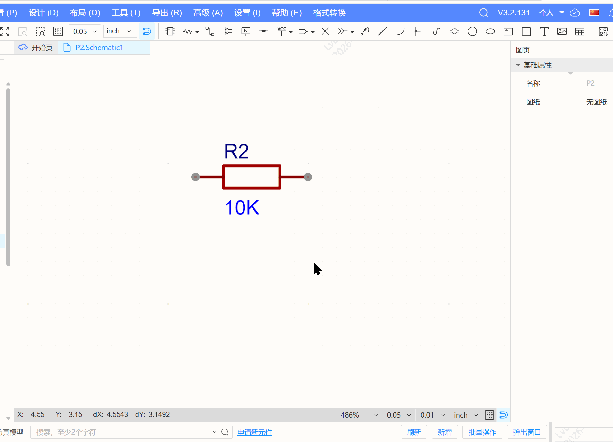

# 格式转换 v1.0.0

嘉立创EDA专业版（EasyEDA Pro）扩展插件，将 Xpedition（Siemens EDA）库文件导入为嘉立创EDA专业版格式。

## 功能

- **导入 Xpedition 库文件**：支持 ZIP 格式的 Xpedition 库包（包含 PSK/CEL/PDB/符号文件），自动解析并转换为嘉立创EDA专业版格式
- **图形化向导**：提供逐步引导界面，包含文件上传、转换进度、结果预览与筛选
- **导入到专业版**：转换完成后可直接导入到个人库或团队库，支持选择归属和按需筛选

## 使用方法

1. 在嘉立创EDA专业版（3.0+）中安装本扩展
2. 通过菜单 **格式转换 → 导入导出向导** 打开向导
3. 选择"导入Xpedition文件"，上传 ZIP 格式的 Xpedition 库包
4. 预览转换结果，选择需要导入的器件/符号/封装
5. 选择归属（个人/团队），点击导入

    

## 支持的文件格式

需要将Xpedition库文件通过打包工具转换成ASCII文件并打包成zip后导入

| 输入格式 | 说明                                       |
| -------- | ------------------------------------------ |
| `.zip`   | 包含 PSK/CEL/PDB/符号文件的 Xpedition 库包 |

转换工具：[使用说明README](https://github.com/easyeda/eext-format-converttools/xpedition-library-packager/README.md)

## 系统要求

- 嘉立创EDA专业版 >= 3.0

## 开源许可

[Apache License 2.0](https://choosealicense.com/licenses/apache-2.0/)
