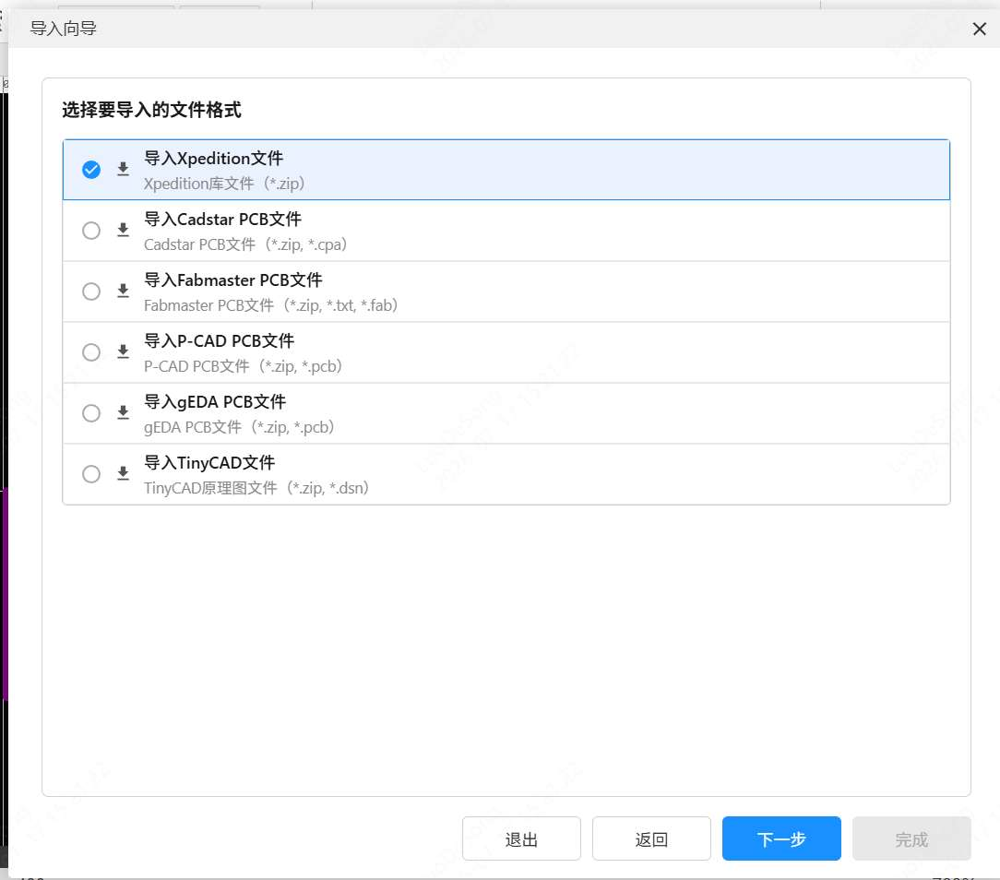

# 格式转换 v1.0.2

嘉立创EDA专业版（EasyEDA Pro）扩展插件，支持 Xpedition、Cadstar、Fabmaster、P-CAD、Allegro、gEDA、TinyCAD 等格式与嘉立创EDA专业版互转，并支持导出 KiCad。

## 功能

- **导入多种格式**：支持 Xpedition（ZIP 库包）、Cadstar、Fabmaster、P-CAD、Allegro、gEDA、TinyCAD 等格式导入为嘉立创EDA专业版库或工程
- **导出 KiCad**：在符号库/封装库编辑器中通过顶部菜单直接导出当前文档为 `.kicad_sym` / `.kicad_mod`
- **导出 Xpedition**：将嘉立创EDA专业版库数据导出为 Xpedition 格式
- **图形化向导**：提供逐步引导界面，包含文件上传、转换进度、结果预览与筛选
- **导入到专业版**：转换完成后可直接导入到个人库或团队库，支持选择归属和按需筛选

## 使用方法

1. 在嘉立创EDA专业版（3.0+）中安装本扩展
2. 通过菜单 **格式转换 → 导入导出向导...** 打开向导
3. 选择需要导入或导出的格式，按向导提示操作
4. 预览转换结果，选择需要导入的器件/符号/封装
5. 选择归属（个人/团队），点击导入

    

## 支持的文件格式

| 方向 | 格式             | 说明                                          |
| ---- | ---------------- | --------------------------------------------- |
| 导入 | `.zip`           | Xpedition 库包（含 PSK/CEL/PDB/符号文件）     |
| 导入 | `.zip/.cpa`      | Cadstar PCB 文件                              |
| 导入 | `.zip/.txt/.fab` | Fabmaster PCB 文件                            |
| 导入 | `.zip/.pcb`      | P-CAD / gEDA PCB 文件                         |
| 导入 | `.zip/.dsn`      | TinyCAD 原理图文件                            |
| 导出 | `.zip`           | Xpedition 格式库包                            |
| 导出 | `.zip`           | KiCad 格式库包（`.kicad_sym` + `.kicad_mod`） |

Xpedition 库文件需要先用打包工具转换成 ASCII 文件并打包成 zip，详见[打包工具说明](https://github.com/easyeda/eext-format-convert/blob/main/tools/xpedition-library-packager/README.md)。

## 系统要求

- 嘉立创EDA专业版 >= 3.0

## 开源许可

[Apache License 2.0](https://choosealicense.com/licenses/apache-2.0/)
